# 일과 · ilgwa

> 주제만 주면 **강의 · 슬라이드 · 음성 수업 · 시험 · 노트**까지 만들어 주는 AI 학습 데스크

[](https://algocean1204.github.io/SW-ilgwa/)

**👉 https://algocean1204.github.io/SW-ilgwa/** — 로그인 없이 버튼 한 번으로 바로 체험.
파이썬 · Rust · 운영체제 **3과목**이 슬라이드 · 음성 · 시험 · 노트까지 미리 채워져 있습니다. *(정적 데모 — 백엔드 없이 동작)*

---

## 🏗 시스템 아키텍처

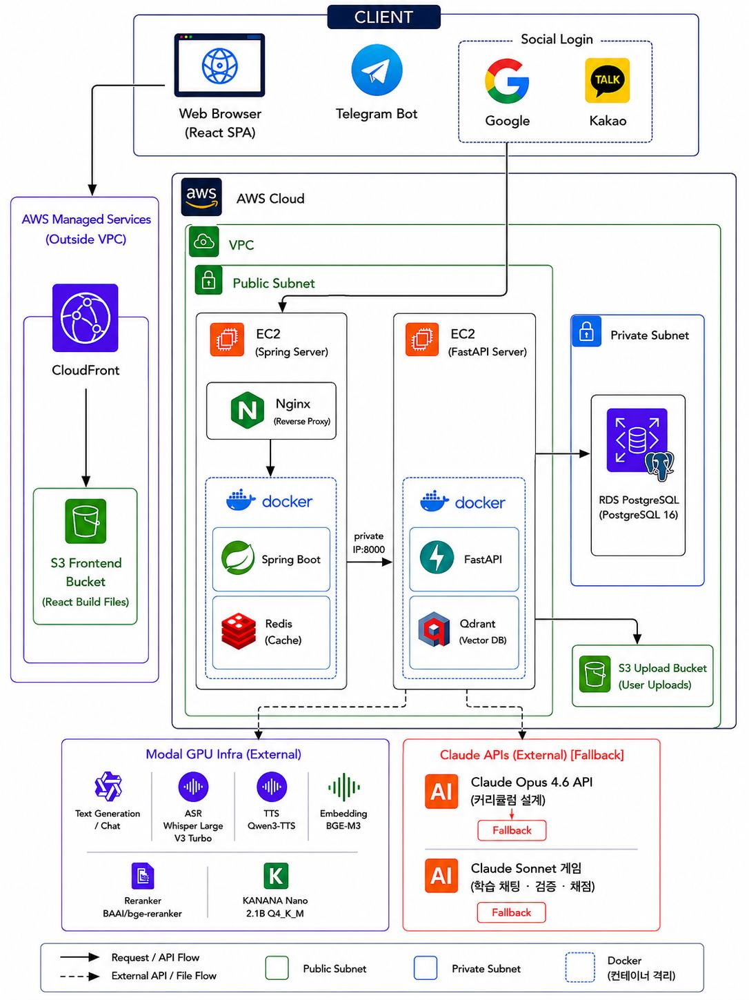

React SPA(CloudFront + S3) · Spring(인증·결제·오케스트레이션) · FastAPI(AI·RAG) · RDS PostgreSQL · Qdrant · Modal GPU · Claude(폴백)로 구성된 AWS VPC 인프라.

---

## 📚 사용자 PDF → OCR → RAG (Qdrant 벡터DB)

사용자가 **교재 PDF를 업로드**하면, 그 내용을 근거로 강의·문제를 만들기 위해 문서를 OCR해 벡터DB에 적재합니다. `LangGraph` 기반 **9단계 인제스트 파이프라인**으로 동작합니다.

```text
PDF 업로드
  → ① 페이지 타입 분류 (born-digital / 스캔 / 혼합)
  → ② OCR 텍스트 추출 (PDF 래스터화 후 OCR)
  → ③ 품질 게이트 ──실패──▶ 폴백 엔진으로 재추출
  → ④ 후처리 (헤더·푸터 제거, 하이픈 복원, 표·수식 정규화)
  → ⑤ 섹션 기반 청킹 (600~1,200 토큰)
  → ⑥ BGE-M3 임베딩 (Dense + Sparse 동시 생성)
  → ⑦ Qdrant 벡터DB 업서트
```

- **하이브리드 RAG 검색** — 강의·시험·노트 생성 시 Qdrant에서 **Dense + Sparse + Reranker**(`bge-reranker-v2-m3`)로 관련 문단을 찾아, AI가 **업로드한 교재 내용에 근거**하도록 강제합니다(환각 억제).
- **품질 게이트 + 폴백** — OCR 결과가 기준에 못 미치면 자동으로 폴백 엔진이 재추출해 적재 품질을 보장합니다.
- **이미지 전처리는 Rust** — PDF 래스터화·이미지 정규화는 Rust PyO3 휠(`lib-rust`)이 FastAPI 프로세스 안에서 인-프로세스로 수행합니다.

> **사용자가 올린 PDF가 곧 교재**가 되고, 그 벡터가 강의·시험·노트 생성의 근거 컨텍스트가 됩니다.

---

## ⚙️ 외부 API 의존 없는 자체 모델 구동 인프라

| 계층 | 역할 |
|---|---|
| **Frontend** (사용자 브라우저) | 학습 요청·결과 확인 · nh3 정제 + iframe 샌드박스 · 보안·렌더링 |
| **Backend** (Spring Boot) | 사용자 인증·권한 · 결제·학습 데이터 적재 · 전체 워크플로우 오케스트레이션 |
| **AI Engine** (Modal B200) | 자체 모델 상주(Cold Start 방지) · 컨텍스트 분할 병렬 추론 · ×4 동시 출제·교차검증 |

> **외부 LLM API 호출이 아니라 Modal B200 위에서 자체 모델을 직접 구동.** 토큰 과금이 아닌 **GPU 시간 과금**으로 강의 1건당 **$0.38**의 압도적 경제성을 달성했습니다.

---

## 🤖 전문 에이전트들의 병렬 파이프라인

```
자료 분석 → 출제 계획 → 문제 생성 (×4 병렬) → 오답 구성 → 정답 해설 → 교차 검증
```

- **초병렬 에이전트 협업** — 문제 생성 단계를 4개 에이전트가 동시 처리해 생성 속도를 극대화하고, 검증 실패 시 자동 수정 루프가 작동합니다.
- **검증된 템플릿 라이브러리** — 16개 디자인 카테고리와 20개 모의고사 문제 유형을 구조화해 AI 답변의 품질 일관성을 확보했습니다.

---

## 🧩 구조는 코드가 결정하고, AI는 `{{빈칸}}`만 채웁니다

구조(프레임 · visual 9종 · 난이도)는 코드가 **plan-first**로 고정하고, AI는 오직 `{{빈칸}}`만 채웁니다.
→ 강의 16종 · 문제 20종이 **항상 동일한 품질**, 추가 학습비 **$0**.

```jsonc
// ChapterStudio_V1 · concept_code (강의 슬라이드 템플릿)
{
  "slide_idx": 0,
  "category": "code",
  "title": "{{핵심_개념}}",
  "narration": "{{설명_200~360자}}",
  "visual": { "type": "step_flow", "data": "{{시각_데이터}}" },
  "checkpoint": "{{성취도_체크}}"
}
```

---

## ⚡ 성능 최적화 (실측)

| 항목 | 값 |
|---|---|
| 초기 콜드 스타트 | ~12.4s |
| **모델 사전 로드 시** | **~0.8s** |
| API 오버헤드 | 0.1s 미만 |
| 강의 생성 시간 | 순차 462s → **병렬 120s** ( **74% ↓** ) |
| 학습 준비 리드타임 | **45% 단축** |

> 모델을 **Modal 스토리지에 미리 로드**해 콜드스타트를 줄이고, 사용자 체감 대기 시간을 최소화했습니다.

---

## 🛠 기술 스택

`React` · `Vite` · `TypeScript` · `Spring Boot` · `Nginx` · `Redis` · `FastAPI` · `Celery` · `Qdrant` · `Modal GPU (B200)` · `Qwen3-TTS` · `Whisper-v3` · `BGE-M3` · `PostgreSQL 16` · `AWS (CloudFront·S3·EC2·RDS)` · `Claude (폴백)`

---

## 📑 발표 자료

프로젝트 최종 발표 슬라이드입니다. 아래에서 바로 펼쳐 볼 수 있고, 전체 PDF로도 내려받을 수 있습니다.

**📥 [발표 PDF 전체 다운로드](docs/ilgwa-presentation.pdf)** · 18장 · 16:9

<details open>
<summary><b>▶ 발표 슬라이드 전체 보기 (18장)</b></summary>

<br>

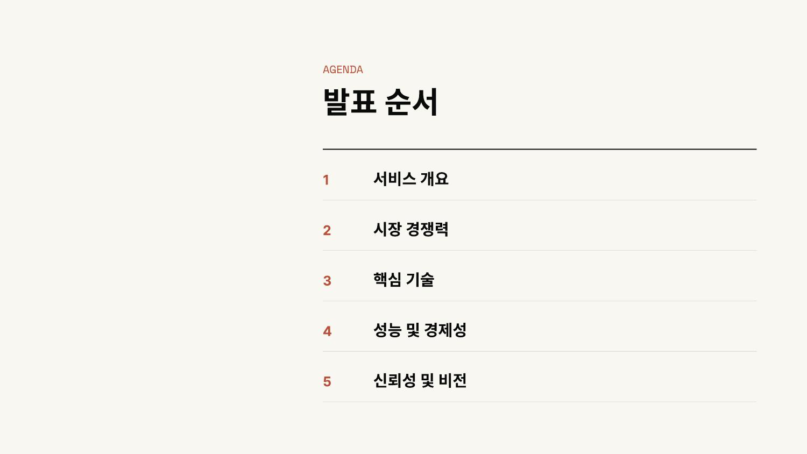
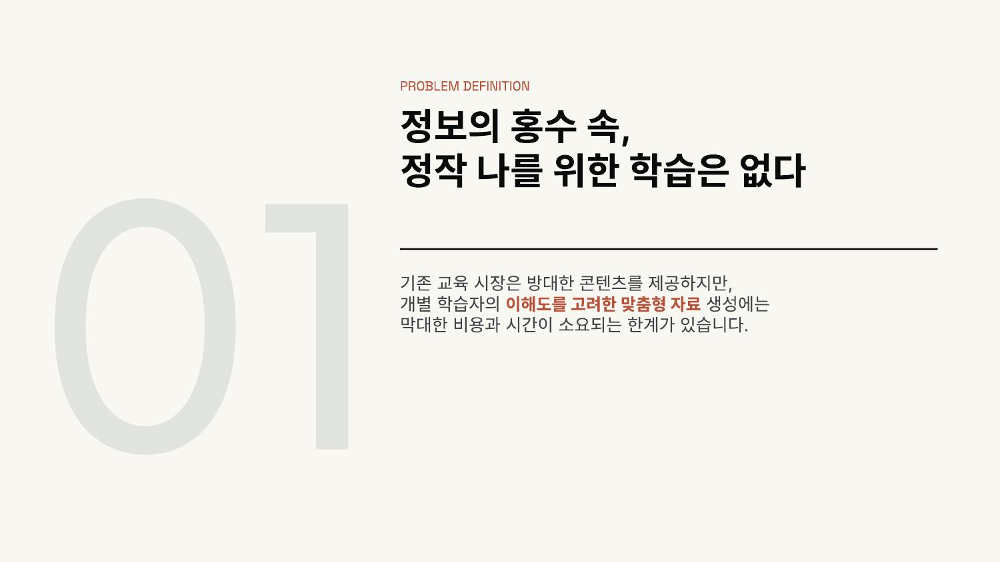
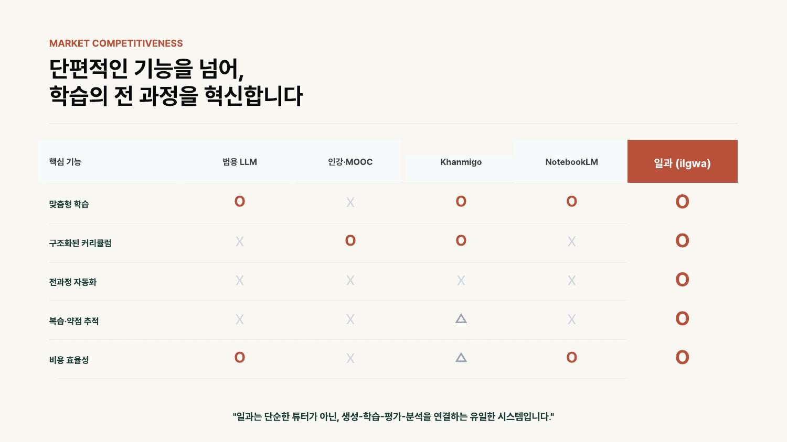
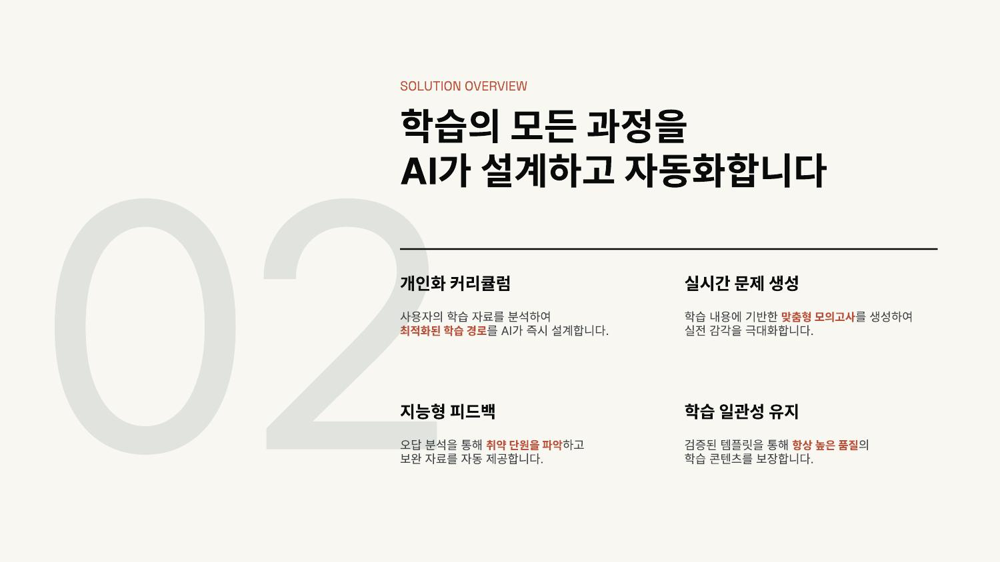
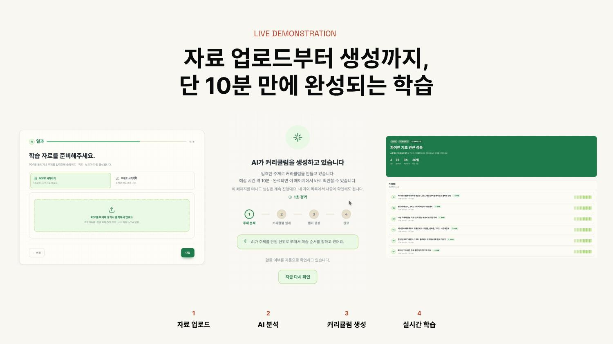
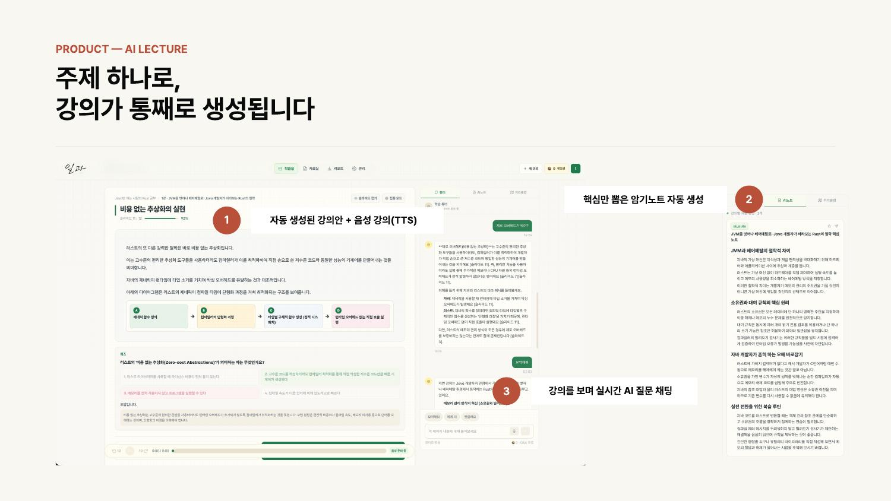
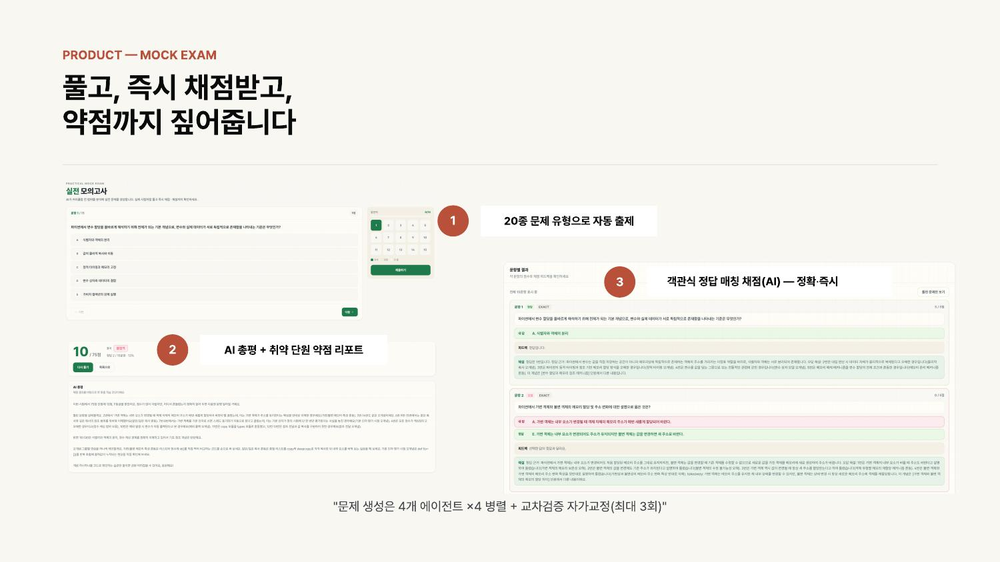
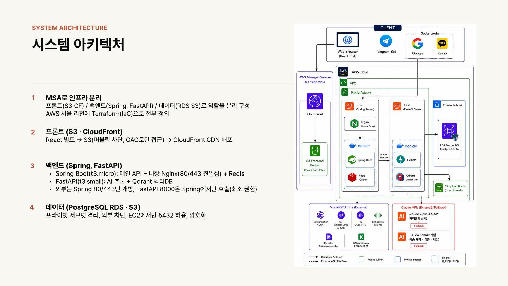
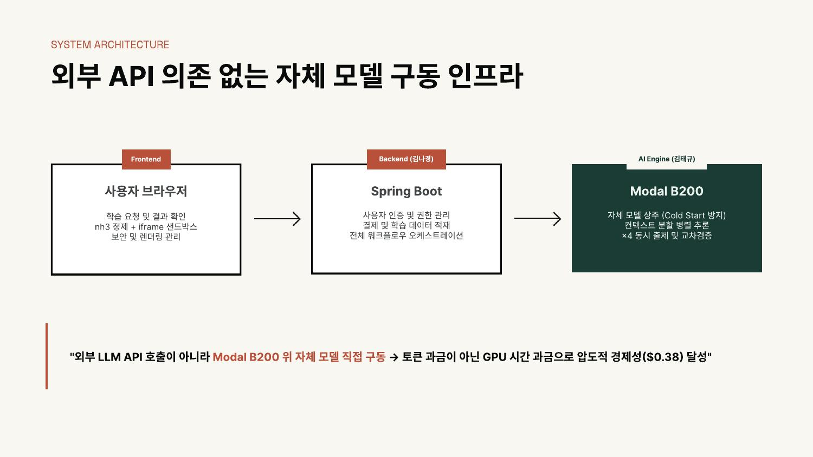
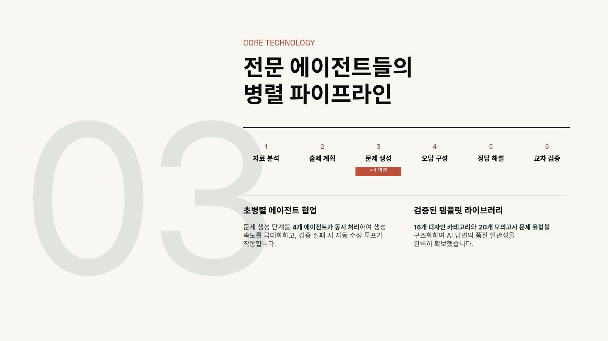
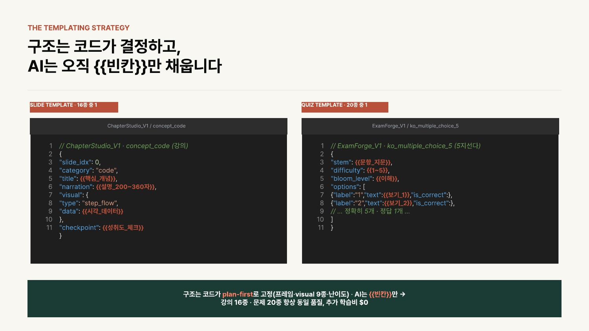
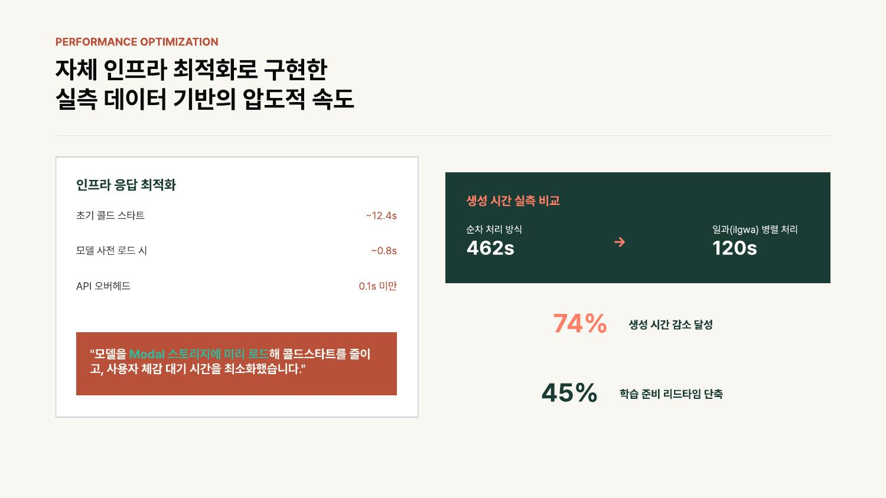
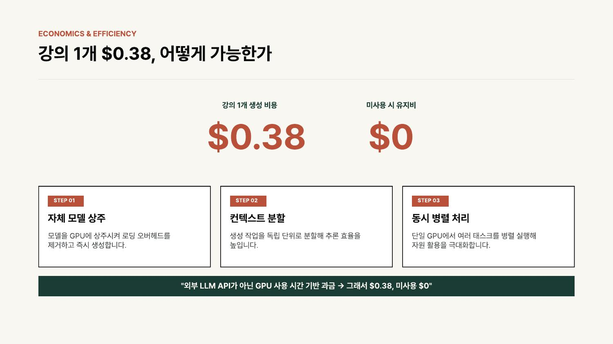
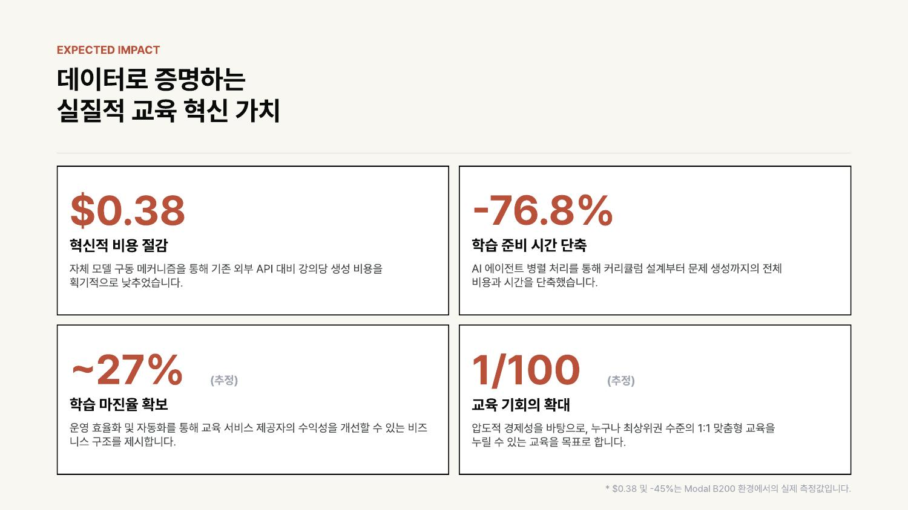
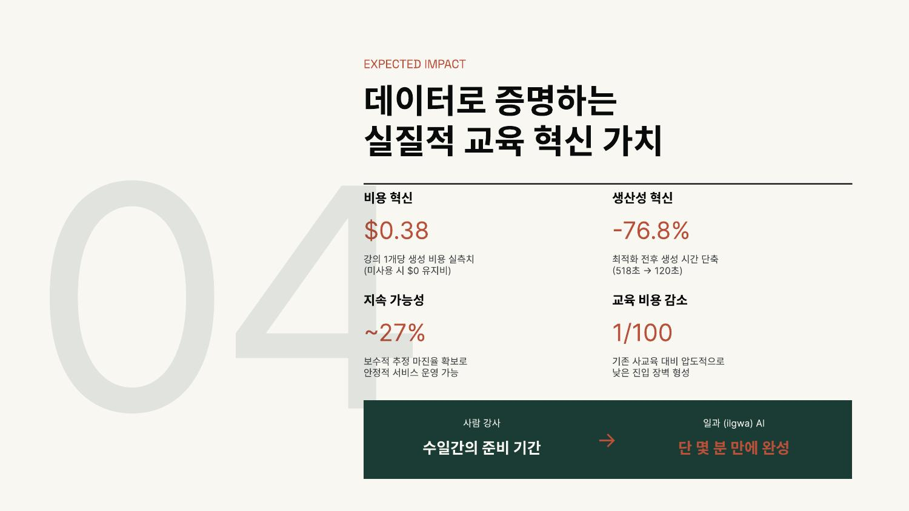
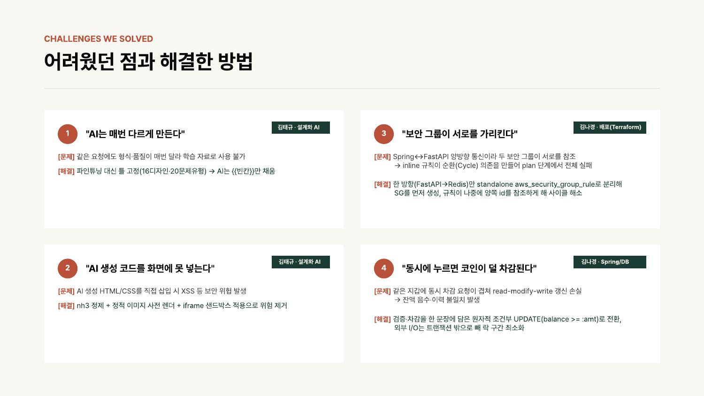
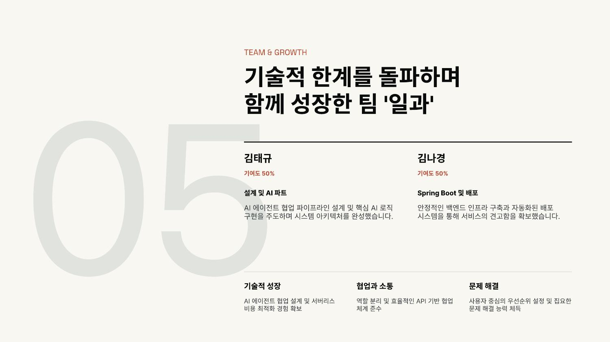
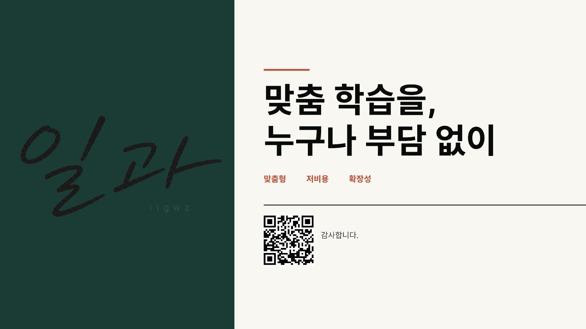

</details>

## 📌 데모 안내

위 라이브 데모는 **정적 박제본**입니다 — 백엔드 없이 동작하며 "AI 생성" 기능만 비활성화되어 있습니다.
미리 만들어진 3과목의 **강의 열람 · 음성 수업 · 모의고사 응시 · 노트 · 과제**를 직접 체험할 수 있습니다.
