# 일과 · ilgwa

주제를 하나 넣으면 강의, 슬라이드, 음성 수업, 시험, 노트까지 만들어 주는 AI 학습 데스크입니다.

데모: https://algocean1204.github.io/SW-ilgwa/

로그인 없이 열립니다. 파이썬, Rust, 운영체제 3과목이 슬라이드와 음성 수업, 시험, 노트까지 미리 채워져 있어서 바로 눌러 볼 수 있습니다.

## 시스템 아키텍처

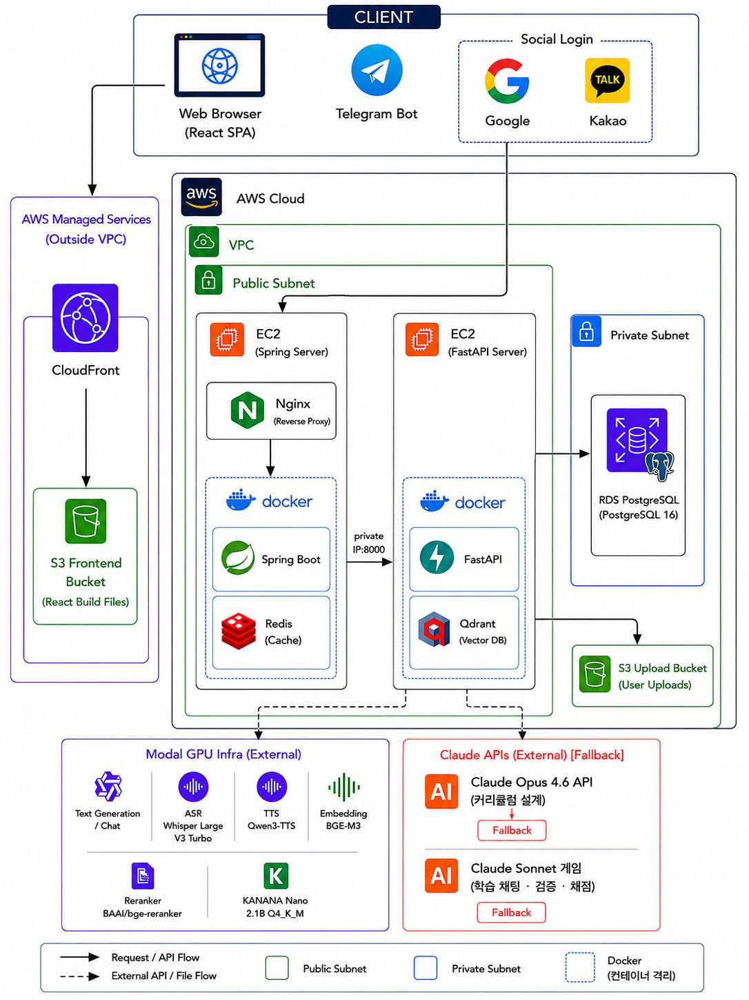

화면은 React SPA(CloudFront + S3), 인증과 결제, 워크플로우 오케스트레이션은 Spring, AI와 RAG는 FastAPI가 맡습니다. 데이터는 RDS PostgreSQL과 Qdrant에 두고 추론은 Modal GPU에서 돌립니다. Claude는 폴백입니다. 전체는 AWS VPC 안에 있습니다.

## 올린 PDF가 그대로 교재가 됩니다

교재 PDF를 업로드하면 OCR을 거쳐 Qdrant에 적재합니다. 그 벡터가 강의와 시험, 노트를 만들 때의 근거 컨텍스트가 됩니다. 파이프라인은 LangGraph로 짰습니다.

```text
PDF 업로드
  → ① 페이지 타입 분류 
  → ② OCR 텍스트 추출 
  → ③ 품질 게이트 ──실패──▶ 폴백 엔진으로 재추출
  → ④ 후처리 (헤더·푸터 제거, 하이픈 복원, 표·수식 정규화)
  → ⑤ 섹션 기반 청킹 
  → ⑥ BGE-M3 임베딩 
  → ⑦ Qdrant 벡터DB 업서트
```

검색은 하이브리드 RAG입니다. Qdrant에서 Dense와 Sparse에 `bge-reranker-v2-m3`를 사용해 관련 문단을 먼저 찾고, 그 문단을 근거 컨텍스트로 넣습니다. 환각을 줄이려고 넣은 장치입니다. 품질 게이트를 통과하지 못한 문서는 폴백 엔진이 자동으로 다시 추출합니다. PDF 래스터화와 이미지 정규화는 Rust PyO3 휠(`lib-rust`)이 FastAPI 프로세스 안에서 직접 처리합니다.

## 모델은 Modal B200에서 직접 돌립니다

| 계층 | 역할 |
|---|---|
| Frontend (사용자 브라우저) | 학습 요청과 결과 확인, nh3 정제와 iframe 샌드박스를 거친 보안 렌더링 |
| Backend (Spring Boot) | 인증·권한, 결제, 학습 데이터 적재, 워크플로우 오케스트레이션 |
| AI Engine (Modal B200) | 자체 모델 상주로 Cold Start 감소, 컨텍스트 분할 병렬 추론, ×4 동시 출제와 교차검증 |

자체 모델을 Modal B200에 상주시켜 구동합니다. 외부 LLM API 호출은 없습니다. 과금이 GPU 시간 단위라 강의 1건을 만드는 데 $0.38이 듭니다.

출제는 이 순서로 흐릅니다.

```
자료 분석 → 출제 계획 → 문제 생성 (×4 병렬) → 오답 구성 → 정답 해설 → 교차 검증
```

문제 생성 단계만 에이전트 4개가 동시에 돌고, 교차 검증에서 걸리면 자동 수정 루프가 다시 돕니다.

## 구조는 코드가 정하고, AI는 `{{빈칸}}`만 채웁니다

프레임과 visual 9종, 난이도를 코드가 plan-first로 미리 고정합니다. 템플릿 라이브러리에는 디자인 카테고리 16종과 모의고사 문제 유형 20종이 들어 있습니다. AI가 손대는 건 `{{빈칸}}`뿐입니다.

```jsonc
// ChapterStudio_V1 · concept_code (강의 슬라이드 템플릿)
{
  "slide_idx": 0,
  "category": "code",
  "title": "{{핵심_개념}}",
  "narration": "{{설명_200~360자}}",
  "visual": { "type": "step_flow", "data": "{{시각_데이터}}" },
  "checkpoint": "{{성취도_체크}}"
}
```

덕분에 강의 16종과 문제 20종의 품질 일관성이 요청마다 유지됩니다. 모델을 새로 학습시키지 않으니 추가 학습비는 $0입니다.

## 성능 (실측)

| 항목 | 값 |
|---|---|
| 초기 콜드 스타트 | ~12.4s |
| 모델 사전 로드 시 | ~0.8s |
| API 오버헤드 | 0.1s 미만 |
| 강의 생성 시간 | 순차 462s → 병렬 120s (74% ↓) |
| 학습 준비 리드타임 | 45% 단축 |

콜드 스타트 두 값의 차이는 모델을 Modal 스토리지에 미리 올려 둔 결과입니다.

## 기술 스택

`React` · `Vite` · `TypeScript` · `Spring Boot` · `Nginx` · `Redis` · `FastAPI` · `Celery` · `Qdrant` · `Modal GPU (B200)` · `Qwen3-TTS` · `Whisper-v3` · `BGE-M3` · `PostgreSQL 16` · `AWS (CloudFront·S3·EC2·RDS)` · `Claude (폴백)`

## 발표 자료

[발표 PDF 전체 다운로드](docs/ilgwa-presentation.pdf) · 18장 · 16:9

<details open>
<summary><b>발표 슬라이드 전체 보기 (18장)</b></summary>
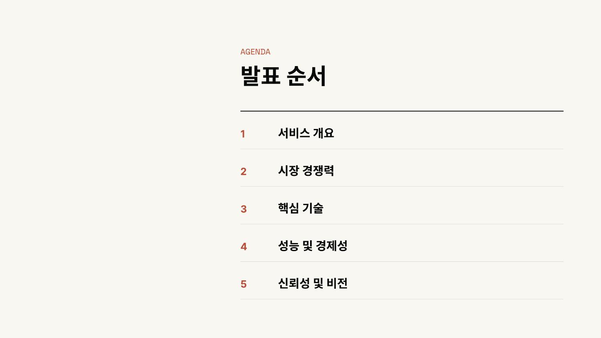

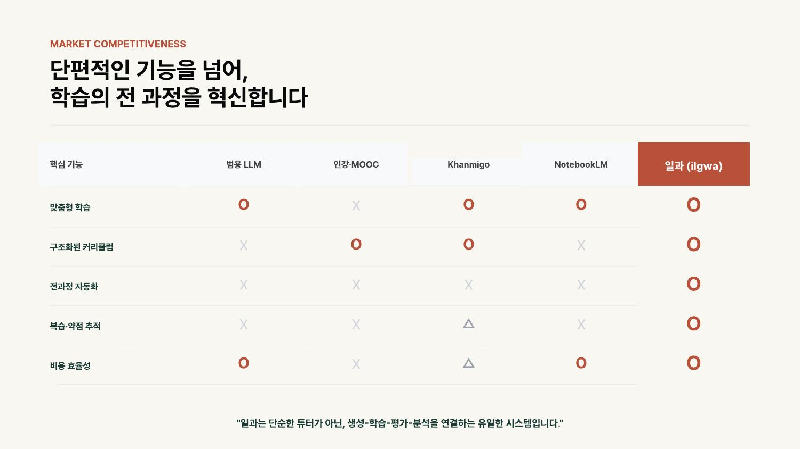
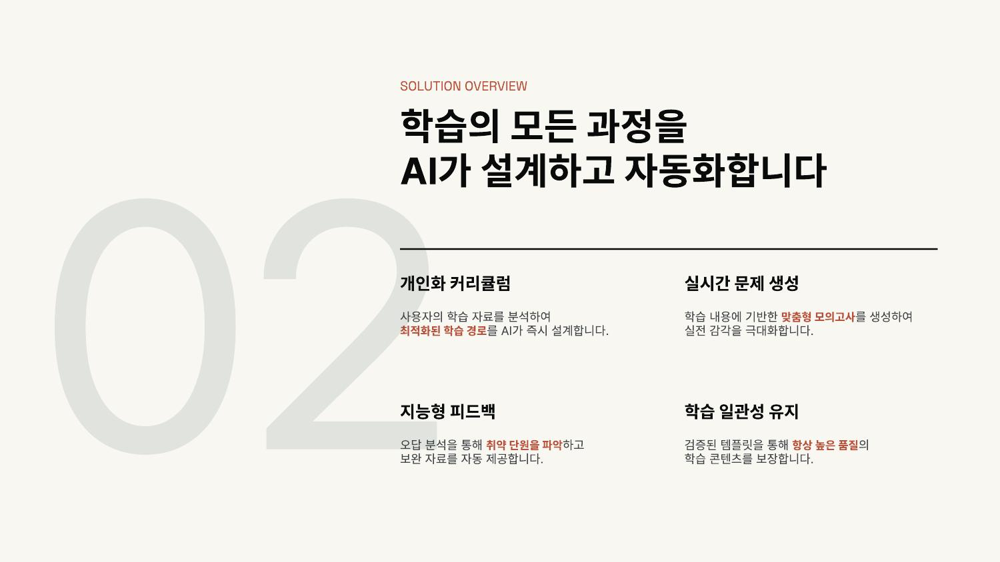
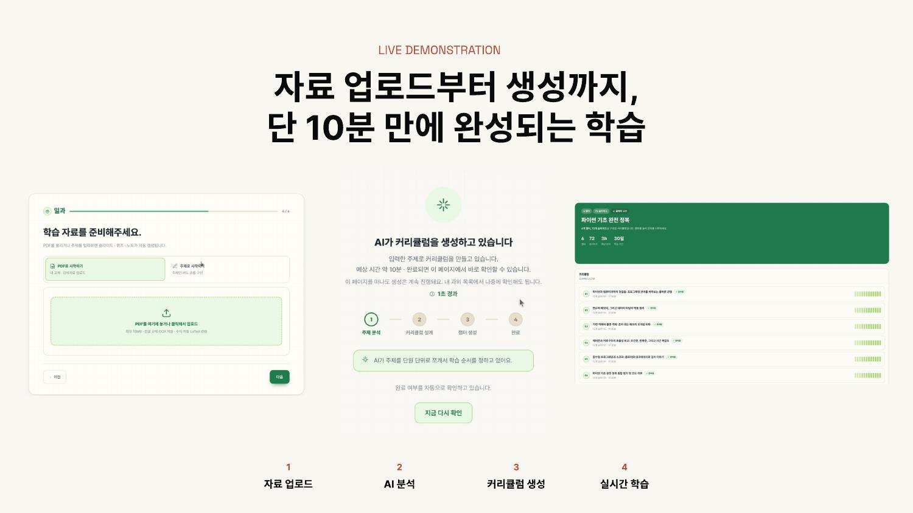
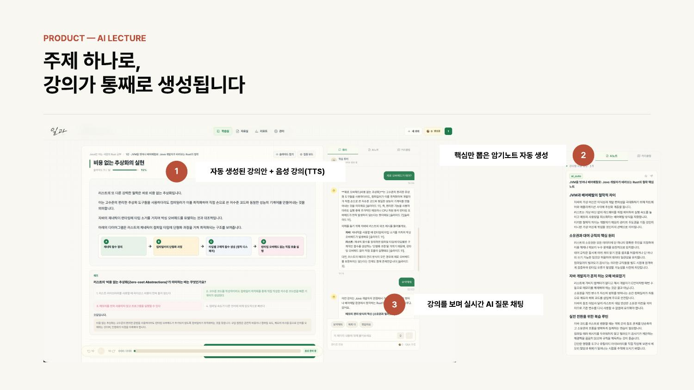
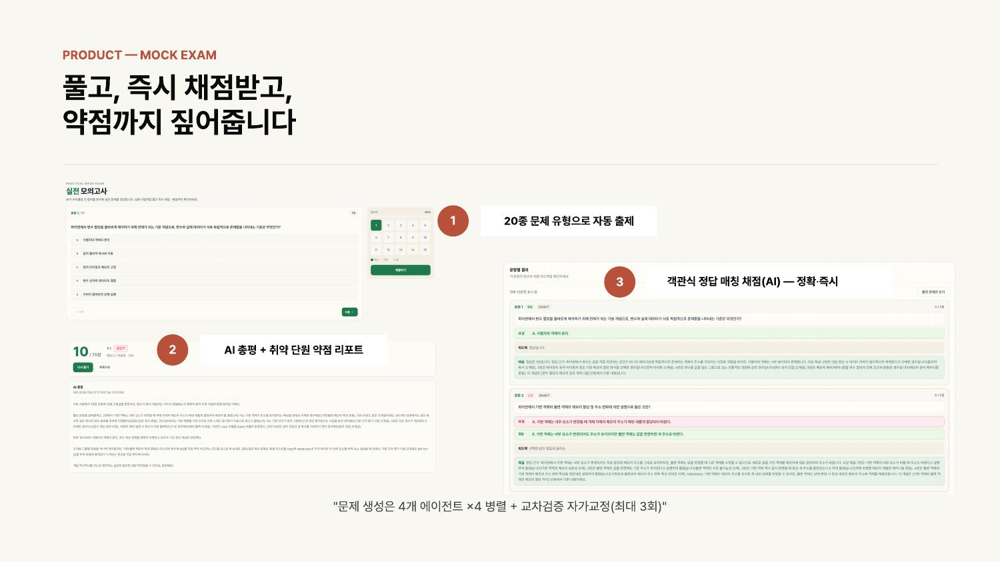
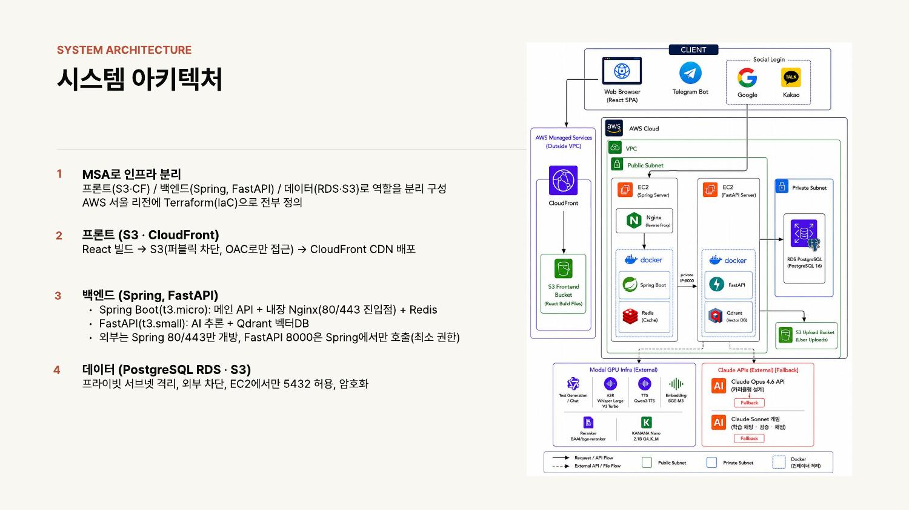
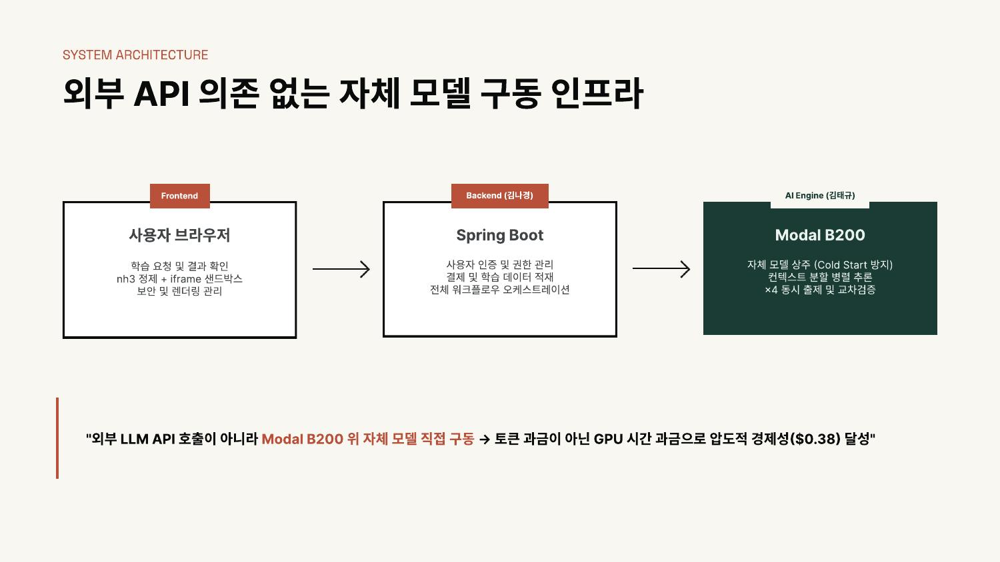
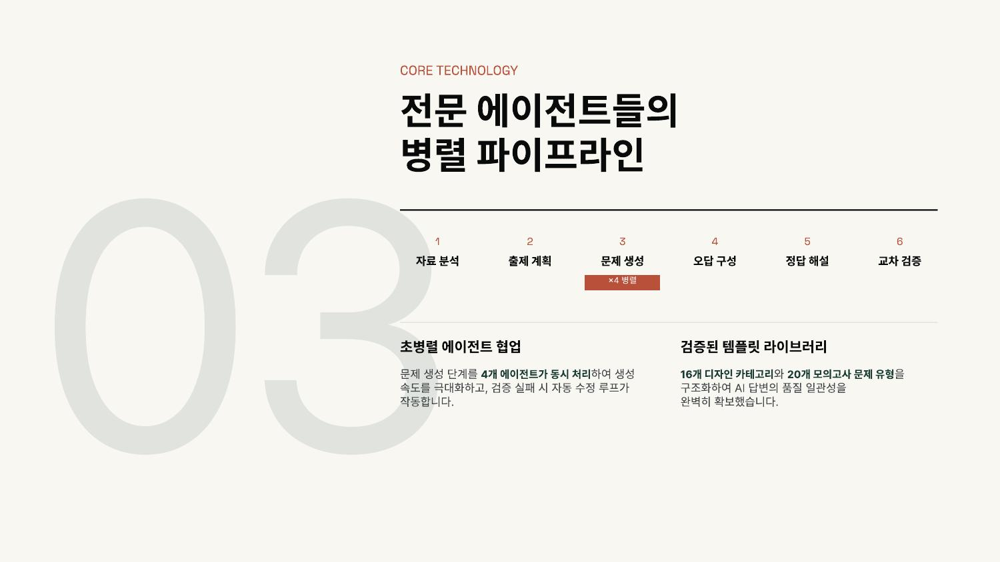
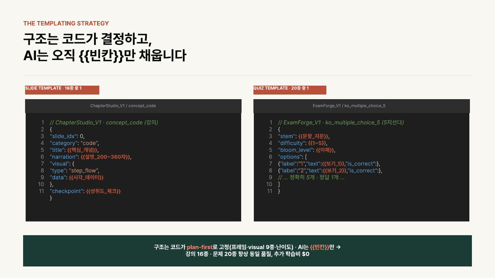
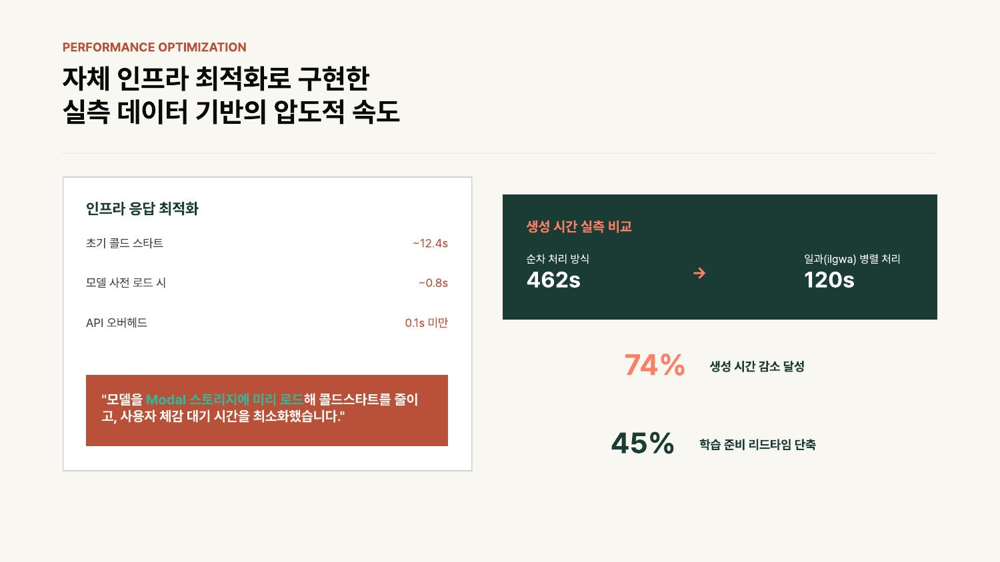
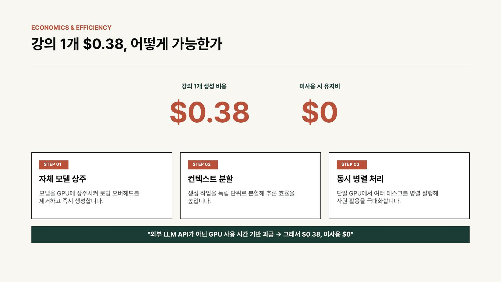
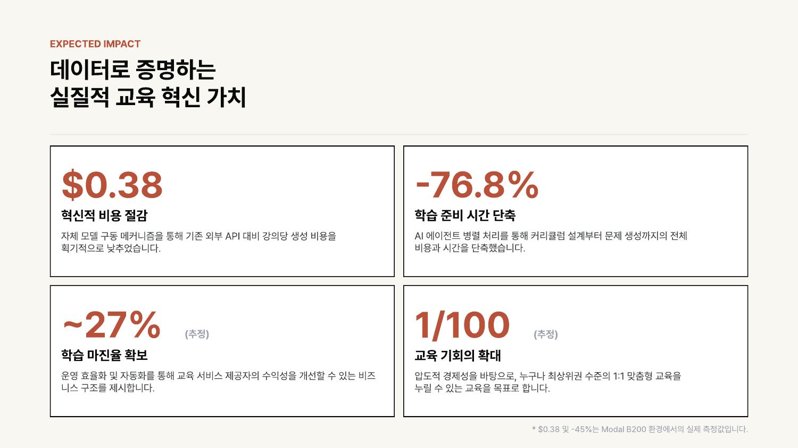
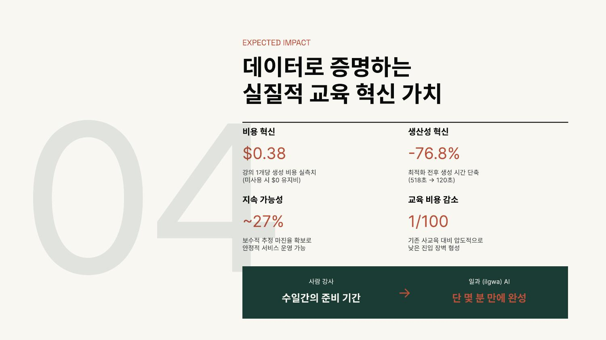
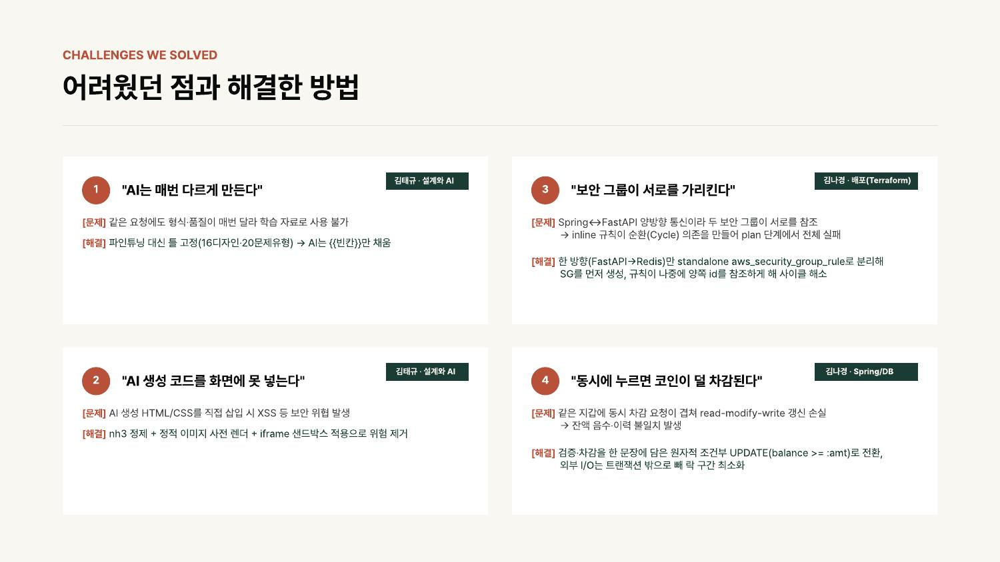
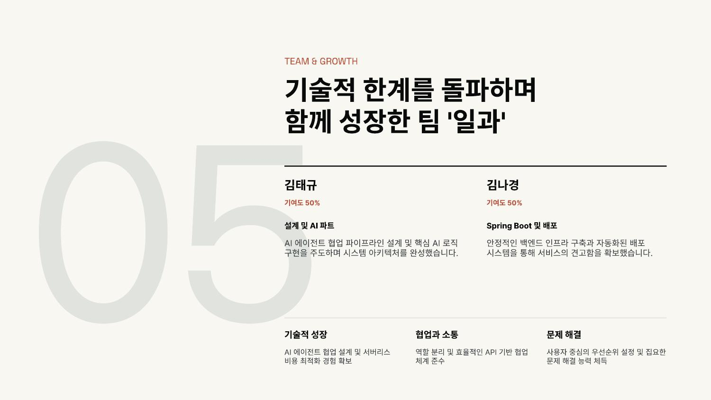

</details>

## 데모에서 되는 것

위 데모는 백엔드 없이 도는 정적 박제본입니다. "AI 생성" 기능만 꺼져 있고, 미리 만들어 둔 3과목의 강의 열람, 음성 수업, 모의고사 응시, 노트, 과제는 그대로 해 볼 수 있습니다.
