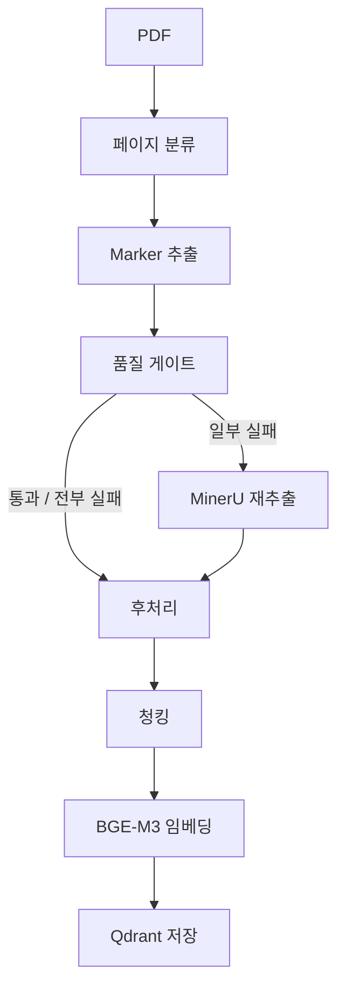
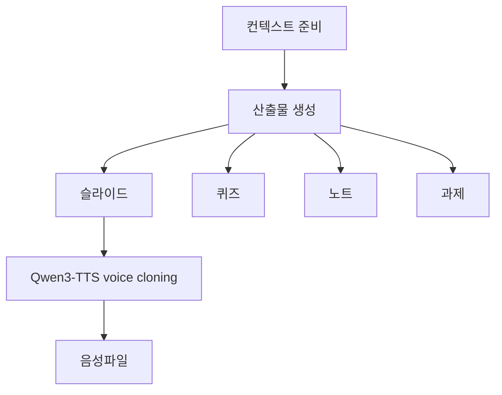
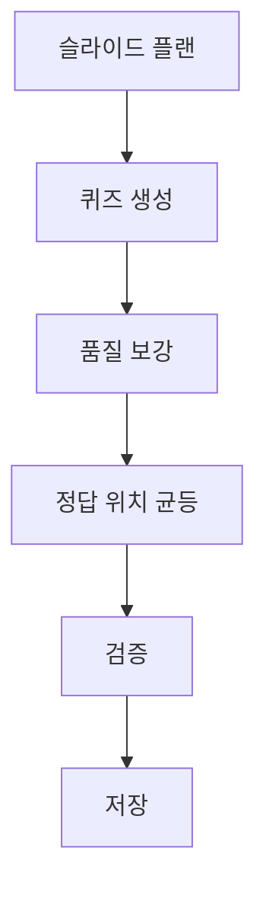
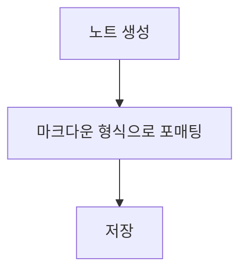
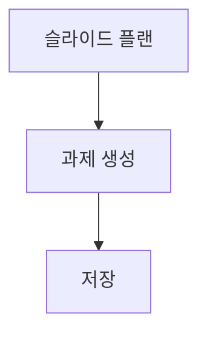
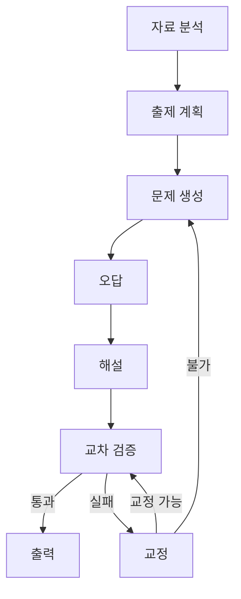
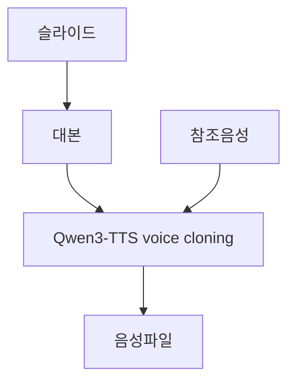

# 일과 · ilgwa

주제를 넣으면 강의·슬라이드·음성 수업·시험·노트까지 만드는 AI 학습 과외 서비스.

데모: https://algocean1204.github.io/SW-ilgwa/

로그인 없이 열립니다. 파이썬, Rust, 운영체제 3과목이 슬라이드와 음성 수업, 시험, 노트까지 미리 채워져 있어서 바로 눌러 볼 수 있습니다.

면접 스토리: https://algocean1204.github.io/SW-ilgwa/ptplo/

이 README는 레포와 파이프라인을 적는다. 역할과 선택 이유는 위 페이지에 있다.

## 시스템 아키텍처

화면은 React SPA, 인증·결제·DB는 Spring, AI는 FastAPI가 맡습니다. 추론은 Modal GPU에서 Qwen을 직접 서빙합니다.

## 서버 구성 - MSA구조

인증·결제·DB 같은 코어는 Spring, AI는 Python으로 구현하려고 FastAPI를 추가했다. 책임을 나누기 위해 서버를 완전 분리했다.

- 프론트 — 학습 UI
- Spring — 인증, 결제, DB 접근
- FastAPI — AI 파이프라인 (설계·구현 담당)

## Modal GPU 서빙

Qwen3.6-27B를 Modal GPU에 올리고 vLLM으로 직접 서빙한다. continuous batching과 슬라이드·퀴즈·노트·과제 병렬 호출로 대기 시간을 줄였다. 클라우드 API는 폴백용이다.

- 실측 — 강의 생성 순차 462s → 병렬 120s
- 폴백 — Modal 실패 시 Gemini 3.5 Flash → Sonnet 4.5 순

## 사용 기술들과 선택 근거

양산은 Modal GPU의 Qwen, 클라우드 API는 폴백용으로만 썼다.

- LangGraph — OCR 품질게이트·강의 생성·출제 재시도 분기를 StateGraph로 묶음
- Qwen3.6-27B — Modal GPU + vLLM 서빙. 배치 스케줄링과 병렬 처리로 속도 효율을 높임
- 폴백 — Modal 실패 시 Gemini 3.5 Flash → Sonnet 4.5 순. API 키는 테스트·폴백용
- OCR — PDF는 Marker로 추출, 품질 게이트 실패 페이지만 MinerU로 재추출한 뒤 청킹
- Qdrant — OCR 청크를 BGE-M3 dense(1024) + sparse로 저장. 검색은 둘을 병렬로 돌린 뒤 합쳐, 그 문단을 강의 생성 컨텍스트로 주입
- Qwen3-TTS — 강의 대본을 voice cloning으로 합성
- Qwen3-ASR — 음성 질문 인식
- 슬라이드 후처리 — FastAPI에서 하이라이트·iframe sandbox. 
- 템플릿 — 프레임·난이도는 코드가 고정하고, AI는 `{{빈칸}}`만 채움

## 파이프라인들 흐름

### OCR (교재 → 검색 인덱스)

### 강의 생성

슬라이드·퀴즈·노트·과제는 동시에 만들고, 음성은 슬라이드 대본을 받은 뒤 합성한다.

### 퀴즈

### 노트

### 과제

채점은 생성 그래프 밖. Spring이 제출을 넘기면 Claude → 실패 시 Gemini, 결과를 콜백한다.

### 시험 출제

### 음성

## 성능 (실측)

| 항목 | 값 |
|---|---|
| 초기 콜드 스타트 | ~12.4s |
| 모델 사전 로드 시 | ~0.8s |
| 강의 생성 | 순차 462s → 병렬 120s |

## 발표 자료

[발표 PDF 전체 다운로드](docs/ilgwa-presentation.pdf) · 18장 · 16:9

<b>발표 슬라이드 전체 보기 (18장)</b>

## 데모에서 되는 것

위 데모는 백엔드 없이 도는 정적 박제본입니다. AI 생성 기능만 꺼져 있고, 미리 만들어 둔 3과목의 강의 열람, 음성 수업, 모의고사 응시, 노트, 과제는 그대로 해 볼 수 있습니다.
