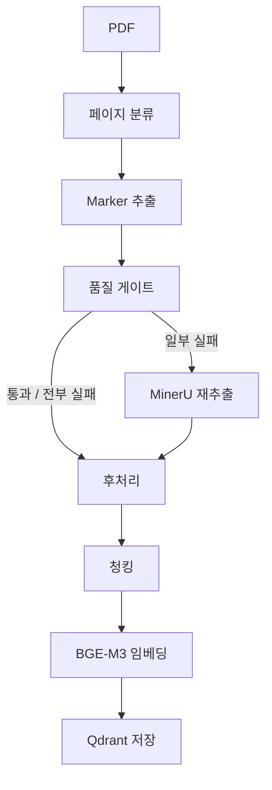
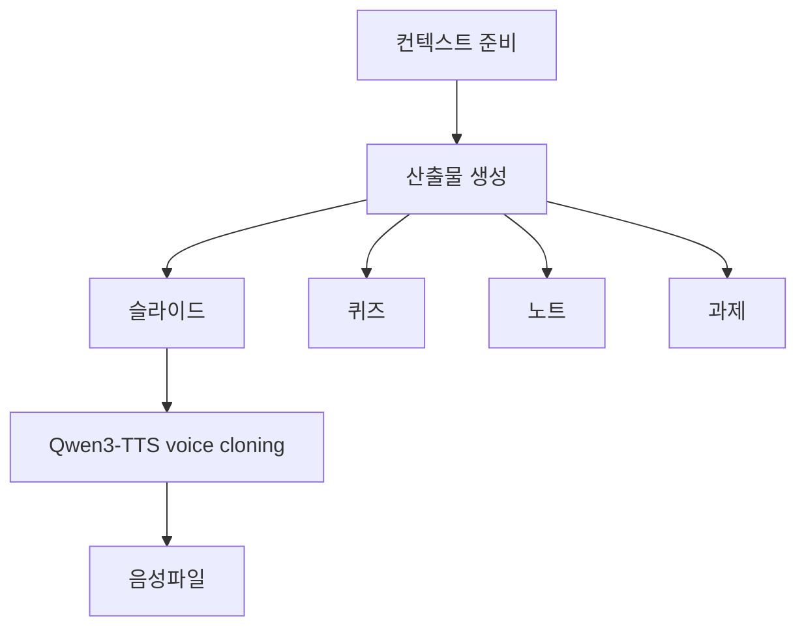
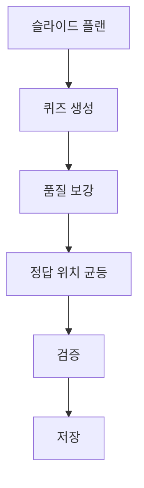
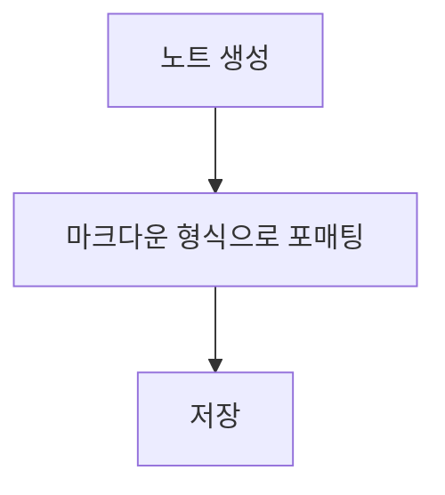
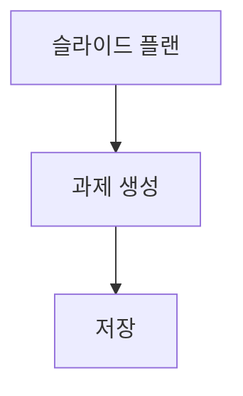
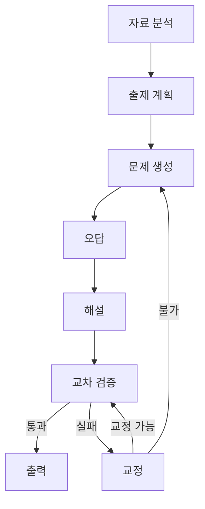
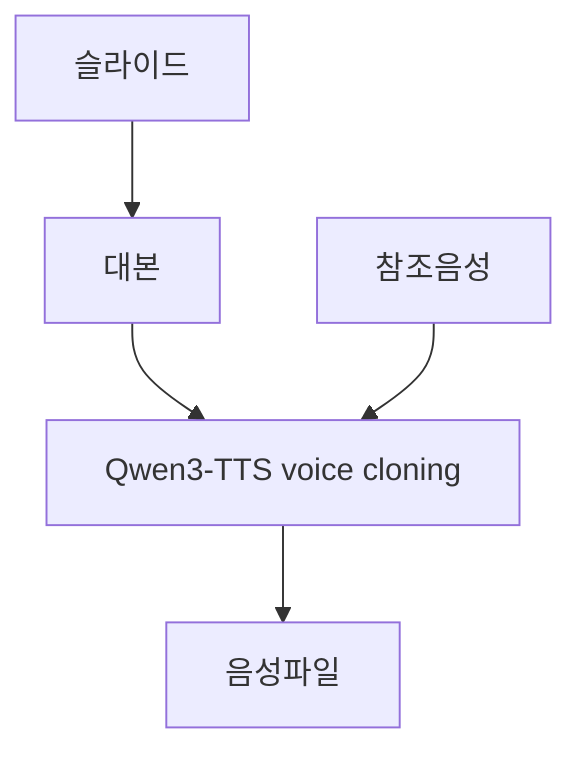

# 일과 · ilgwa

AI 학습 과외 서비스는 주제를 넣으면 강의·슬라이드·음성 수업·시험·노트까지 만듭니다.

데모: https://algocean1204.github.io/SW-ilgwa/

로그인 없이 열립니다. 파이썬, Rust, 운영체제 3과목이 슬라이드와 음성 수업, 시험, 노트까지 미리 채워져 있어서 바로 눌러 볼 수 있습니다.

포트폴리오: https://algocean1204.github.io/SW-ilgwa/ptplo/

역할과 선택 이유는 포트폴리오에 있습니다. 이 README는 레포와 파이프라인을 적습니다.

## 시스템 아키텍처

화면은 React SPA, 인증·결제·DB는 Spring, AI는 FastAPI가 맡습니다. 추론은 Modal GPU에서 Qwen을 직접 서빙합니다.

## 서버 구성 - MSA 구조

인증·결제·DB 같은 코어는 Spring, AI는 Python으로 구현하려고 FastAPI를 추가했습니다. 책임을 나누기 위해 서버를 완전 분리했습니다.

- 프론트 — 학습 UI
- Spring — 인증, 결제, DB 접근
- FastAPI — AI 파이프라인 (설계·구현 담당)

## Modal GPU 서빙 & 생성 속도 최적화

Qwen3.6-27B Dense FP8을 Modal GPU B200에 올리고 vLLM을 활용해 동시 병렬로 직접 서빙합니다. 슬라이드 15장을 개별 컨텍스트로 분할해 병렬 할당하고, 퀴즈·노트·과제 동시 생성 및 음성 비동기 큐 분리로 전체 생성 시간을 단축했습니다.

- 실측 — 15슬라이드 1강 (검증·음성 포함) 순차 462s → vLLM 병렬 120s (74% 단축, 3.85배 개선)
- 기동 지연 — 초기 콜드스타트 12.4s → 메모리 사전 로드 0.8s (15.5배 가속)
- 장애 대응 — Modal 실패 시 Gemini 3.5 Flash → Sonnet 4.5 3단계 비상 대체(폴백) 연결 구축

## 사용 기술과 선택 근거

- **FastAPI** — 대규모 비동기 I/O(`asyncio`) 처리 및 Spring 코어 서버와의 명확한 책임 분리
- **Modal GPU B200 + vLLM** — Qwen3.6-27B Dense FP8 오픈소스 서빙으로 상용 API 종속 탈피 및 시간당 초단위 과금 최적화
- **계층적 LLM 라우팅** — 기획(Opus) ↔ 양산(Qwen3.6) ↔ 질의응답(Sonnet) 분리로 All Sonnet 대비 월 ₩6.9M (15.8%) 비용 절감 (마진 26% 확보)
- **LangGraph** — OCR 품질 게이트 조건부 분기 및 평가 문항 교차 검증·선별 재시도 루프 제어
- **하이브리드 OCR** — Marker 1차 파싱 + 품질 게이트 실패 페이지만 MinerU 선별 재추출 (CER 48.8%·75.9% → 0.222로 98.6% 개선)
- **Qdrant & BGE-M3** — Dense(1024차원) + Lexical Sparse 앙상블 검색으로 교재 RAG 환각 원천 차단
- **SlideDesignSystem & 보안** — 16종 CSS 락, 백엔드 Shiki 문법 하이라이팅, nh3 살균, `iframe sandbox="allow-scripts"` 격리 렌더링
- **Qwen3-TTS** — 슬라이드 대본 완료 즉시 비동기 큐 위임, 화자 유사도 0.964~0.976 (std 0.0006) Voice Cloning
- **Qwen3-ASR** — 실시간 음성 질문 텍스트 변환 (RTF 0.075~0.260)

## 파이프라인 흐름

### OCR (교재 → 검색 인덱스)

```mermaid
flowchart TD
  pdf[PDF] --> classify[페이지 분류]
  classify --> extract[Marker 추출]
  extract --> gate[품질 게이트]
  gate -->|통과 / 전부 실패| post[후처리]
  gate -->|일부 실패| mineru[MinerU 재추출]
  mineru --> post
  post --> chunk[청킹]
  chunk --> embed[BGE-M3 임베딩]
  embed --> qdrant[Qdrant 저장]
```

### 강의 생성

```mermaid
flowchart TD
  ctx[컨텍스트 준비] --> gen[산출물 생성]
  gen --> slides[슬라이드]
  gen --> quiz[퀴즈]
  gen --> note[노트]
  gen --> hw[과제]
  slides --> tts[Qwen3-TTS voice cloning]
  tts --> audio[음성파일]
```

슬라이드·퀴즈·노트·과제는 동시에 만듭니다. 음성은 슬라이드 대본을 받은 뒤 합성합니다.

### 퀴즈

```mermaid
flowchart TD
  outline[슬라이드 플랜] --> gen[퀴즈 생성]
  gen --> repair[품질 보강]
  repair --> balance[정답 위치 균등]
  balance --> verify[검증]
  verify --> save[저장]
```

### 노트

```mermaid
flowchart TD
  gen[노트 생성] --> md[마크다운 형식으로 포매팅]
  md --> save[저장]
```

### 과제

```mermaid
flowchart TD
  outline[슬라이드 플랜] --> gen[과제 생성]
  gen --> save[저장]
```

채점은 생성 그래프 밖에서 합니다. Spring이 제출을 넘기면 Claude → 실패 시 Gemini, 결과를 콜백합니다.

### 시험 출제

```mermaid
flowchart TD
  src[자료 분석] --> plan[출제 계획]
  plan --> q[문제 생성]
  q --> dist[오답]
  dist --> ans[해설]
  ans --> verify[교차 검증]
  verify -->|통과| out[출력]
  verify -->|실패| repair[교정]
  repair -->|교정 가능| verify
  repair -->|불가| q
```

### 음성

```mermaid
flowchart TD
  slides[슬라이드] --> script[대본]
  script --> tts[Qwen3-TTS voice cloning]
  ref[참조음성] --> tts
  tts --> audio[음성파일]
```

## 핵심 성능 실측 지표

| 항목 | 이전 상태 (Baseline) | 최적화 결과 | 엔지니어링 임팩트 |
|---|---|---|---|
| **15슬라이드 1강 생성** (검증·음성 포함) | 순차 파이프라인 462s | **vLLM 병렬 할당 120s** | **74% 단축 (3.85배 개선)** |
| **GPU 인스턴스 기동 지연** | 초기 콜드스타트 12.4s | **메모리 사전 로드 0.8s** | **93.5% 단축 (15.5배 가속)** |
| **교재 OCR 문자오류율 (CER)** | PaddleOCR ONNX 48.8% / VL 75.9% | **하이브리드 게이트 적용 0.222** | **98.6% 개선 (수식·표 보존 100%)** |
| **LLM 서빙 월간 비용** (1,000명 기준) | All Sonnet ₩43.72M | **워크로드 계층 라우팅 ₩36.75M** | **월 ₩6.9M (15.8%) 절감 (마진 26%)** |
| **음성 합성 품질** (Qwen3-TTS) | 베이스라인 CER 0.221 / 유사도 0.929 | **화자 유사도 0.964~0.976** | **목표(≥0.85) 상회, std 0.0006** |

## 발표 자료

[발표 PDF 전체 다운로드](docs/ilgwa-presentation.pdf) · 18장 · 16:9

<b>발표 슬라이드 전체 보기 (18장)</b>

## 데모에서 되는 것

위 데모는 정적 박제본입니다. 백엔드 없이 돌아갑니다. AI 생성 기능만 꺼져 있습니다. 3과목의 강의 열람, 음성 수업, 모의고사 응시, 노트, 과제는 미리 만들어 두었습니다. 그대로 해 볼 수 있습니다.
